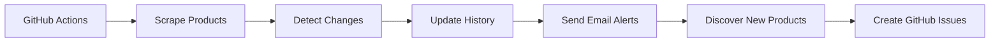

# Multi-Site Price Monitoring System

A sophisticated, automated price monitoring system that tracks product prices across **Björn Borg** (Finnish site), **Fitnesstukku** (Finnish fitness supplements), and **cross-store EAN tracking** (Apteekki360, Sinunapteekki, Ruohonjuuri, Tokmanni), with intelligent GitHub issue-based product management and robust structured data extraction.

## 🏗️ Architecture Overview

This system uses a modern, resilient architecture with structured data prioritization:

### Core Components

```
├── scrapers/                    # Modular scraper architecture
│   ├── base_scraper.py         # Common interface & utilities
│   ├── bjornborg.py            # JSON-LD structured data scraper
│   └── fitnesstukku.py         # dataTrackingView structured data scraper
├── price_monitor.py            # Main orchestration & GitHub integration
├── ean_price_monitor.py        # Cross-store EAN price comparison
├── email_sender.py             # Resend API email notifications
├── email_templates.py          # HTML email generation
├── product_manager.py          # GitHub issue comment processing
├── products.yaml               # Product configuration (auto-managed)
├── ean_products.yaml           # EAN products with store URLs
├── price_history.json          # Historical price data (event-based)
└── ean_price_history.json      # Cross-store price data (event-based)
```

### Key Features

- **🤖 Automated GitHub Issues**: Newly discovered products create issues for track/ignore decisions
- **📊 Structured Data Extraction**: Prioritizes JSON-LD and dataLayer over brittle CSS
- **📧 Smart Email Alerts**: Multi-site HTML notifications via Resend API
- **📈 Price Analytics**: Trend analysis and monthly reports
- **🔄 Zero-Maintenance**: Fully automated via GitHub Actions
- **🏪 Cross-Store Comparison**: EAN-based tracking across multiple Finnish stores
- **📦 Event-Based Storage**: Efficient data format that only records actual price changes (25x compression)

## 🚀 How It Works

### 1. **Daily Monitoring Cycle** (9:00 AM UTC)


### 2. **Product Discovery & Management**
When new products are discovered:
1. **GitHub Issue Created** with product details
2. **Email Notification** sent to you
3. **Reply "track" or "ignore"** via email or GitHub
4. **Automated Processing** updates configuration
5. **Issue Auto-Closed** with confirmation

### 3. **Structured Data Extraction**

**Björn Borg** (JSON-LD Schema.org):
```json
{
  "@type": "Product",
  "name": "Essential Socks 10-pack",
  "sku": "10004564_MP001",
  "offers": {
    "price": 35.96,
    "priceCurrency": "EUR",
    "availability": "InStock"
  }
}
```

**Fitnesstukku** (dataTrackingView ecommerce):
```javascript
{
  "event": "productDetail",
  "ecommerce": {
    "detail": {
      "products": [{
        "id": "5854R",
        "name": "Whey-80, 4 kg, Double Rich Chocolate",
        "brand": "Star Nutrition",
        "price": "89.90"
      }]
    }
  }
}
```

## 📋 Current Products Tracked

### Björn Borg (11 products)
- **Essential Socks 10-pack**: 8 color variants
- **Centre Crew Sweatshirt**: 3 colors (Grey, Blue, Black)

### Fitnesstukku (2 products)
- **Whey-80 Protein 4kg** (Star Nutrition)
- **Creatine Monohydrate 500g** (Star Nutrition)

### EAN Cross-Store Tracking (1 product across 4 stores)
- **Puhdas+ Premium Omega-3 1000mg 180 kaps** - tracked at Apteekki360, Tokmanni, Sinunapteekki, Ruohonjuuri

## ⚙️ Setup & Configuration

### Prerequisites
- Python 3.11+
- UV package manager
- Resend API key
- GitHub repository with Actions enabled

### Environment Variables
Create `.env` file:
```bash
RESEND_API_KEY="your-resend-api-key"
EMAIL_TO="your-email@example.com"
```

### Installation
```bash
# Install dependencies
uv sync

# Test scrapers
uv run python3 -c "from scrapers import BjornBorgScraper, FitnesstukuScraper; print('✅ Scrapers ready')"

# Run full monitoring cycle
source .env && uv run python3 price_monitor.py
```

## 📦 Adding New Products

### Method 1: Automatic Discovery (Recommended)

The system automatically discovers new Björn Borg Essential 10-pack variants. When found:

1. **GitHub Issue Created** with product details
2. **Email Sent** to your configured address
3. **Reply Process**:
   - Reply to email with `track` or `ignore`
   - Or comment on GitHub issue directly
4. **Automatic Processing** updates `products.yaml`
5. **Issue Closed** with confirmation

### Method 2: Manual Addition

#### Adding Björn Borg Products

1. **Find the Product URL**
   ```bash
   # Example: https://www.bjornborg.com/fi/essential-socks-10-pack-12345-mp001/
   ```

2. **Add to products.yaml**
   ```yaml
   products:
     bjornborg:
       - name: "Essential Socks 10-pack (New Variant)"
         url: "/fi/essential-socks-10-pack-12345-mp001/"
         product_id: "12345"
         site: "bjornborg"
         category: "socks"  # or "apparel"
         status: "track"
   ```

3. **Commit Changes**
   ```bash
   git add products.yaml
   git commit -m "Add new Björn Borg product: Essential Socks 10-pack (New Variant)"
   git push
   ```

#### Adding Fitnesstukku Products

1. **Find the Product URL**
   ```bash
   # Example: https://www.fitnesstukku.fi/casein-protein-2kg/ABC123.html
   ```

2. **Add to products.yaml**
   ```yaml
   products:
     fitnesstukku:
       - name: "Casein Protein 2kg"
         url: "https://www.fitnesstukku.fi/casein-protein-2kg/ABC123.html"
         product_id: "ABC123"
         site: "fitnesstukku"
         category: "protein"  # or "supplements", "nutrition"
         status: "track"
   ```

3. **Test the Product**
   ```bash
   source .env && uv run python3 -c "
   from scrapers import FitnesstukuScraper
   scraper = FitnesstukuScraper()
   product = scraper.scrape_product_page('https://www.fitnesstukku.fi/casein-protein-2kg/ABC123.html')
   print('✅ Product data:', product)
   "
   ```

4. **Commit Changes**
   ```bash
   git add products.yaml
   git commit -m "Add new Fitnesstukku product: Casein Protein 2kg"
   git push
   ```

### Method 3: Temporary Testing

For testing without permanent addition:

```bash
source .env && uv run python3 -c "
from scrapers import BjornBorgScraper
scraper = BjornBorgScraper()

# Test a Björn Borg product
product = scraper.scrape_product_page('/fi/new-product-url/')
print('Product data:', product)
"
```

## 🎯 Product Configuration Reference

### Required Fields
```yaml
- name: "Product Display Name"          # Human-readable name
  url: "/relative/or/full/url/"         # Product page URL
  product_id: "12345"                   # Unique identifier (extracted from URL/page)
  site: "bjornborg"                     # Site identifier: "bjornborg" or "fitnesstukku"
  category: "socks"                     # Product category for organization
  status: "track"                       # Tracking status: "track" or "ignore"
```

### Category Guidelines

**Björn Borg:**
- `socks` - All sock products (Essential, ankle, etc.)
- `apparel` - Clothing items (Centre Crew, sweaters, etc.)

**Fitnesstukku:**
- `protein` - Whey, casein, protein powders
- `supplements` - Creatine, vitamins, etc.
- `nutrition` - General nutrition products

### Status Options
- `track` - Monitor price changes and send alerts
- `ignore` - Keep in config but don't monitor (useful for discontinued products)

## 📊 GitHub Actions Workflows

### Daily Price Monitor
- **Schedule**: 9:00 AM UTC daily
- **Triggers**: Automatic + manual via GitHub UI
- **Actions**: Scrape → Detect changes → Send emails → Discover products

### Comment Processor
- **Trigger**: GitHub issue comments
- **Function**: Process "track"/"ignore" commands
- **Security**: Only repository owner can manage products

## 🛠️ Development & Testing

### Local Testing
```bash
# Test individual scrapers
source .env && uv run python3 -c "from scrapers import BjornBorgScraper; print(BjornBorgScraper().scrape_all_products())"

# Test full monitoring
source .env && uv run python3 price_monitor.py

# Test email system
source .env && uv run python3 email_sender.py
```

### Adding New Sites

To add support for a new e-commerce site:

1. **Create New Scraper**
   ```python
   # scrapers/newsite.py
   from .base_scraper import BaseScraper
   
   class NewSiteScraper(BaseScraper):
       def extract_structured_data(self, soup, url):
           # Implement structured data extraction
           pass
       
       def extract_fallback_data(self, soup, url):
           # Implement CSS selector fallback
           pass
   ```

2. **Update Package**
   ```python
   # scrapers/__init__.py
   from .newsite import NewSiteScraper
   __all__ = ['BjornBorgScraper', 'FitnesstukuScraper', 'NewSiteScraper']
   ```

3. **Integrate with Monitor**
   ```python
   # price_monitor.py
   self.newsite_scraper = NewSiteScraper()
   ```

4. **Add Products Configuration**
   ```yaml
   # products.yaml
   products:
     newsite:
       - name: "Product Name"
         url: "https://newsite.com/product"
         # ... other fields
   ```

## 🔒 Security & Best Practices

### Environment Security
- **Never commit API keys** - Use `.env` file (gitignored)
- **Use GitHub Secrets** for production API keys
- **Validate input** in product_manager.py

### Scraping Ethics
- **Respectful delays** - 1 second between requests
- **User-Agent headers** - Identify as legitimate browser
- **Error handling** - Fail gracefully, don't overwhelm servers

### Data Management
- **price_history.json** - Managed by GitHub Actions only
- **products.yaml** - Can be edited manually or via issues
- **Backup important data** - History file contains valuable price data

## 📈 Analytics & Reporting

The system includes advanced analytics:

- **Monthly Reports** - Comprehensive price trend analysis
- **Seasonal Patterns** - Holiday and seasonal price tracking  
- **Best Deal Alerts** - Automated notifications for significant drops
- **Historical Tracking** - Long-term price history (365 days retention)

## 🐛 Troubleshooting

### Common Issues

**"No products found"**
```bash
# Check product URLs are accessible
curl -I "https://www.bjornborg.com/fi/your-product-url/"

# Verify products.yaml syntax
uv run python3 -c "import yaml; print(yaml.safe_load(open('products.yaml')))"
```

**"Email not sending"**
```bash
# Test email configuration
source .env && uv run python3 email_sender.py
```

**"Scraper failing"**
```bash
# Test individual product
source .env && uv run python3 -c "
from scrapers import BjornBorgScraper
scraper = BjornBorgScraper()
product = scraper.scrape_product_page('/fi/your-product-url/')
print(product)
"
```

### Debug Mode
```bash
# Enable debug logging
source .env && PYTHONPATH=. uv run python3 -c "
import logging
logging.basicConfig(level=logging.DEBUG)
from price_monitor import PriceMonitor
monitor = PriceMonitor()
# Your debug code here
"
```

## 📄 License & Contributing

This is a personal price monitoring system. Feel free to fork and adapt for your own use cases.

### Recent Improvements
- ✅ **Event-based data storage** - 25x compression, only records actual price changes
- ✅ **EAN cross-store monitoring** - Compare prices across Apteekki360, Sinunapteekki, Ruohonjuuri, Tokmanni
- ✅ **Modular scraper architecture** with structured data prioritization
- ✅ **GitHub issue-based product management** replacing email workflows
- ✅ **100% structured data extraction** for maximum reliability
- ✅ **Enhanced robustness** against website changes
- ✅ **Comprehensive error handling** with loud failures

### Data Format
The system uses an **event-based format** that only records price changes:
```json
{
  "product_key": {
    "current": {"price": 31.47, "since": "2025-12-25"},
    "all_time_lowest": {"price": 31.47, "date": "2025-11-25"},
    "price_changes": [
      {"date": "2025-07-04", "price": 35.96, "type": "initial"},
      {"date": "2025-08-05", "from": 35.96, "to": 38.21, "change_pct": 6.3}
    ]
  }
}
```

---

**🤖 Automated by GitHub Actions | 📧 Powered by Resend API | 🏗️ Built with Python & UV**